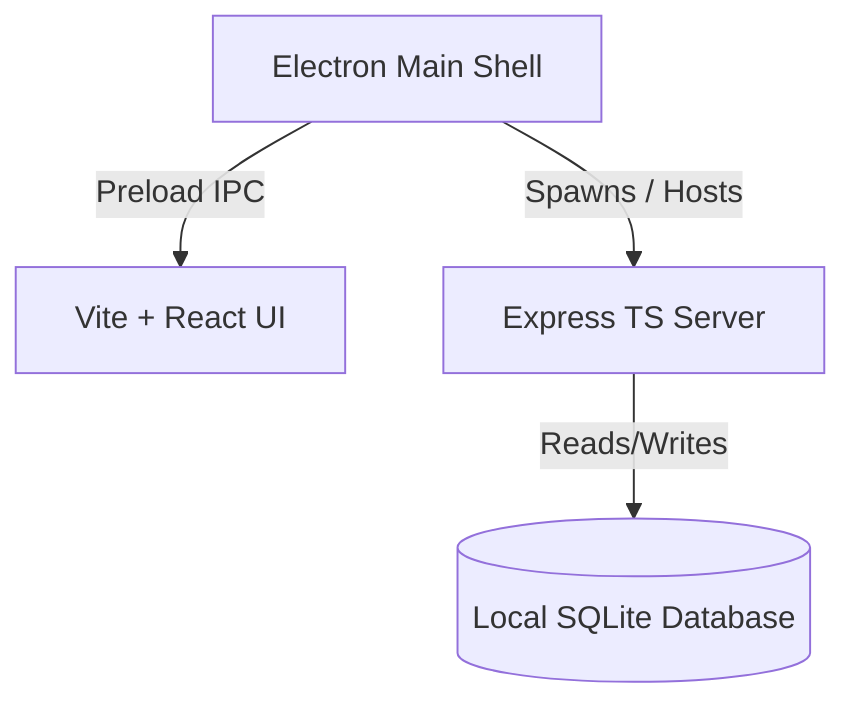

<div align="center">

  
  
  
  

  # ⚡ ServiceFlow Desktop ERP

  ### *A High-Performance, Offline-First Desktop Application for Service & Repair Centers*

  ---

  [](https://microsoft.com)
  [](https://www.electronjs.org/)
  [](https://react.dev/)
  [](https://tailwindcss.com)

  <p align="center">
    <b>ServiceFlow</b> is a modern, enterprise-ready, desktop application engineered specifically for electronics repairing hubs, IT support desk operators, and service companies. Operating completely offline, it guarantees maximum operational speeds, bulletproof data privacy, and robust database management directly on-premise.
  </p>

  ---
</div>

## 🌌 Key Highlights & Features

<table width="100%">
  <tr>
    <td width="50%" valign="top">
      <h3>🔑 Secure Access & Smart Guard</h3>
      <ul>
        <li><b>Role-based access</b> for administrators and technicians.</li>
        <li><b>Auto-Logout Guard</b> triggered instantly on session expiration.</li>
        <li>Encrypted user credentials utilizing salted bcrypt algorithms.</li>
      </ul>
    </td>
    <td width="50%" valign="top">
      <h3>🔍 Instant Customer Lookup</h3>
      <ul>
        <li>Lookup entire records by customer mobile.</li>
        <li><b>Smart Auto-populate</b> to load names, addresses, and history.</li>
        <li>Speeds up ticket registration by up to 80%.</li>
      </ul>
    </td>
  </tr>
  <tr>
    <td width="50%" valign="top">
      <h3>🛠️ Service Lifecycle System</h3>
      <ul>
        <li>Visual workflows for registering, updating, and dispatching jobs.</li>
        <li>Dynamic technician assignment and diagnostic logging.</li>
        <li>Comprehensive tracking of service history on a per-device basis.</li>
      </ul>
    </td>
    <td width="50%" valign="top">
      <h3>📊 Invoice & Report Printout</h3>
      <ul>
        <li>Professional EJS-based layouts configured for print.</li>
        <li>Dedicated print windows previewing PDF invoices on demand.</li>
        <li>Custom business profiling (logo, contact info, branding).</li>
      </ul>
    </td>
  </tr>
  <tr>
    <td width="50%" valign="top">
      <h3>🛡️ Warranty & Categories Tracker</h3>
      <ul>
        <li>Track item warranty dates, coverage windows, and terms.</li>
        <li>Custom categorizations for hardware assets.</li>
        <li>Automatic warnings for expired warranty coverages.</li>
      </ul>
    </td>
    <td width="50%" valign="top">
      <h3>💾 Database Backup & Maintenance</h3>
      <ul>
        <li>One-click backups to secure system state.</li>
        <li>System restore tools to roll back configurations cleanly.</li>
        <li>Full database resetting with self-healing system checks.</li>
      </ul>
    </td>
  </tr>
</table>

---

## 🛠️ Technology Stack & Architecture

ServiceFlow leverages a robust decoupled architecture running inside a native Electron shell:



* **Frontend Framework**: React v19, TypeScript, Vite (Next-gen bundling)
* **Styling**: Tailwind CSS & custom CSS systems for elegant micro-interactions
* **Backend Layer**: Express Server (written in modular TypeScript)
* **Data Storage**: High-performance SQLite database (`node-sqlite3-wasm`)
* **Reports Generator**: Express EJS HTML-to-Print layouts

---

## 🚀 Installation & Local Development

Follow these setup steps to launch ServiceFlow on your machine:

### 📋 Prerequisites
* [Node.js](https://nodejs.org/) (LTS Version)
* [npm](https://www.npmjs.com/)

### 🔧 Step-by-Step Setup

1. **Clone the Repository**
   ```bash
   git clone <your-repo-link>
   cd service-management-electron
   ```

2. **Install Root & Backend Dependencies**
   ```bash
   npm install
   ```

3. **Install Frontend Client Dependencies**
   ```bash
   cd frontend
   npm install
   cd ..
   ```

### 🧑‍💻 Running in Development Mode

Run the following command in the root directory to spin up the entire stack concurrently:

```bash
# Starts both frontend Vite server and backend Express server concurrently
npm run dev

# Starts the Electron wrapper shell
npm run electron:dev
```

---

## 📦 Packaging & Compiling Installer

Produce a production-grade, standalone Windows executable installer (`.exe`) via `electron-builder`:

```bash
npm run package
```
> [!NOTE]
> The compiled executable along with setup configurations will be placed under the `/release` directory.

---

## 📂 Project Directory Structure

```
.
├── assets/                    # Graphic assets & app icons
├── backend/                   # Node/Express TypeScript server
│   ├── src/
│   │   ├── config/            # DB connections & variables
│   │   ├── controller/        # API request logic handlers
│   │   ├── middleware/        # JWT auth & session timers
│   │   └── routes/            # Route declarations
│   ├── views/                 # Invoice & report print layouts (EJS)
│   └── service_management.db  # Primary SQLite database
├── electron/                  # Electron Main Process & Preload API
└── frontend/                  # React & Vite client
    ├── src/
    │   ├── components/        # Shared UI elements
    │   └── pages/             # Core dashboards & settings
```
